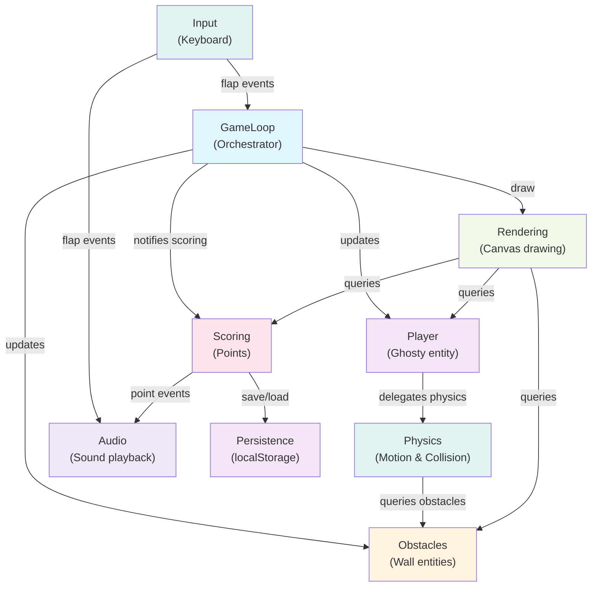

# Flappy Kiro — Component Design

## Component Catalogue (Machine-Readable)

```yaml
components:
  - name: GameLoop
    summary: Orchestrates game state machine, frame timing, and component coordination
    behaviour: >
      Manages the game lifecycle (ready, playing, ended states). Owns frame timing via requestAnimationFrame.
      Updates all components each frame in sequence: Input → Player → Physics → Obstacles → Scoring checks → Rendering.
      Handles state transitions: ready→playing (on player flap), playing→ended (on collision), ended→ready (on restart).
      Coordinates collision detection between Player and Obstacles, scoring pass-through detection.
    responsibilities:
      - Game state machine (ready, playing, ended)
      - Frame timing and update loop
      - Component orchestration and sequencing
      - State transitions and game flow
      - Collision event routing to Scoring
    depends_on:
      - component: Input
        interaction: Reads flap events to transition ready→playing and to restart
        style: event-driven
      - component: Player
        interaction: Updates player state each frame
        style: sync
      - component: Physics
        interaction: Applies physics simulation to player
        style: sync
      - component: Obstacles
        interaction: Updates obstacle spawning and positions
        style: sync
      - component: Scoring
        interaction: Notifies Scoring of pass-throughs and collisions
        style: sync
      - component: Rendering
        interaction: Signals render each frame
        style: sync
    dependents: []
    external_dependencies:
      - name: requestAnimationFrame
        kind: browser-api
        purpose: Frame timing and game loop scheduling
    entities: []

  - name: Player
    summary: Owns Ghosty entity state and lifecycle
    behaviour: >
      Represents the player character (Ghosty). Owns position (x, y) and velocity (vx, vy).
      Exposes methods: flap() to apply upward impulse, update(deltaTime, physics) to evolve state.
      Exposes query methods: getPosition(), getBounds() for collision checks and rendering.
      Persists horizontally (constant rightward velocity from GameLoop).
    responsibilities:
      - Ghosty entity ownership
      - Position and velocity state
      - Flap action handling
      - Collision bounds calculation
    depends_on:
      - component: Physics
        interaction: Delegates motion simulation (gravity, impulse, collision) to Physics.simulate()
        style: sync
    dependents:
      - component: GameLoop
        interaction: GameLoop updates player and queries state for rendering
      - component: Rendering
        interaction: Rendering queries position and bounds to draw Ghosty sprite
    external_dependencies: []
    entities:
      - name: Ghosty
        identifier: player_instance (singleton)
        attributes: [x, y, vx, vy, width, height]
        references: []

  - name: Physics
    summary: Simulates motion, applies forces, detects collisions
    behaviour: >
      Provides physics simulation: applies gravity (constant downward acceleration),
      impulse (upward boost on flap), and velocity integration.
      Detects collisions: AABB overlap checks between Ghosty bounds and obstacle geometry,
      ceiling/ground boundary checks.
      Exposes methods: simulate(entity, deltaTime, obstacles, boundaries) returns updated entity state + collision info.
      Encodes collision information: collision type (wall, ceiling, ground) and collision object identity.
    responsibilities:
      - Gravity and impulse physics
      - Velocity integration and position update
      - AABB collision detection with obstacles
      - Boundary collision detection (ceiling, ground)
      - Collision metadata and reporting
    depends_on:
      - component: Obstacles
        interaction: Queries obstacle geometry for collision checks
        style: sync
    dependents:
      - component: Player
        interaction: Player delegates motion simulation to Physics.simulate()
      - component: GameLoop
        interaction: GameLoop calls Physics indirectly via Player
    external_dependencies: []
    entities: []

  - name: Obstacles
    summary: Owns and manages wall entities, procedural generation
    behaviour: >
      Procedurally generates walls at regular horizontal intervals.
      Owns all active wall entities: position, gap size, gap offset.
      Exposes methods: update(deltaTime) to advance wall positions and spawn new walls,
      getWalls() to query all active obstacles, removePassedWall(wallId) to despawn off-screen walls.
      Encodes gap geometry: two vertical segments with centered gap of fixed size.
      Implements randomized gap vertical positioning within safe bounds (not at top/bottom).
    responsibilities:
      - Wall entity ownership and lifecycle
      - Procedural wall generation and spawning logic
      - Gap randomization and positioning
      - Obstacle position tracking
      - Off-screen wall despawning
    depends_on: []
    dependents:
      - component: Physics
        interaction: Physics queries obstacle geometry for collision checks
      - component: Rendering
        interaction: Rendering queries wall positions and gap geometry to draw obstacles
      - component: GameLoop
        interaction: GameLoop calls obstacles.update() each frame
    external_dependencies: []
    entities:
      - name: Wall
        identifier: wallId (auto-incremented)
        attributes: [wallId, x, gapCenter, gapSize, width, height]
        references: []

  - name: Scoring
    summary: Tracks current and high score, detects scoring events
    behaviour: >
      Tracks current score and high score. Exposes methods: addPoint() to increment current score
      (called when Ghosty passes through a wall gap), getHighScore() to query persisted high score,
      setHighScore(score) to update high score (called on game end if current > high score).
      On game end, persists high score via Persistence component.
      Emits scoring events: onPointEarned(points) for audio and UI feedback.
    responsibilities:
      - Current and high score state
      - Scoring logic and event triggers
      - Score persistence coordination
      - Scoring event emission
    depends_on:
      - component: Persistence
        interaction: Calls Persistence.load('high-score') on init, Persistence.save('high-score', score) on update
        style: sync
    dependents:
      - component: GameLoop
        interaction: GameLoop notifies Scoring of pass-through events
      - component: Rendering
        interaction: Rendering queries current and high score for display
      - component: Audio
        interaction: Audio listens for Scoring.onPointEarned() event
    external_dependencies: []
    entities:
      - name: ScoreState
        identifier: score_instance (singleton)
        attributes: [currentScore, highScore]
        references: []

  - name: Persistence
    summary: Abstracts browser local storage API
    behaviour: >
      Provides a simple key-value storage interface wrapping browser localStorage.
      Exposes methods: save(key, value) to persist data, load(key) to retrieve persisted data.
      Handles JSON serialization and deserialization transparently.
      Gracefully handles missing keys (returns null or default).
    responsibilities:
      - LocalStorage API abstraction
      - Save/load key-value data
      - JSON serialization
      - Error handling for storage unavailability
    depends_on: []
    dependents:
      - component: Scoring
        interaction: Scoring calls Persistence.load/save for high score
    external_dependencies:
      - name: localStorage
        kind: browser-api
        purpose: Persistent key-value storage for high score
    entities: []

  - name: Rendering
    summary: Manages canvas, sprite loading, and frame drawing
    behaviour: >
      Loads and caches sprites (Ghosty, wall segments, background, UI elements).
      Sets up canvas and 2D rendering context.
      Provides draw(gameState) method that renders the current game state to canvas.
      Handles screen transitions: draws ready screen (title, "Press Spacebar"), game screen (player, obstacles, score),
      or end screen (final score, high score, menu options) based on gameState.game_state value.
      Sprite drawing is sprite-aware: positions, rotations, and layering are applied per sprite.
    responsibilities:
      - Canvas setup and context management
      - Sprite asset loading and caching
      - Screen rendering based on game state
      - Layered drawing (background, obstacles, player, UI, score)
      - Screen state transitions (ready, playing, ended)
    depends_on:
      - component: GameLoop
        interaction: GameLoop calls rendering.draw(gameState) each frame
        style: sync
      - component: Player
        interaction: Rendering queries Player.getPosition() and Player.getBounds() to draw Ghosty
        style: sync
      - component: Obstacles
        interaction: Rendering queries Obstacles.getWalls() to draw wall geometry
        style: sync
      - component: Scoring
        interaction: Rendering queries Scoring.getCurrentScore() and Scoring.getHighScore() for UI display
        style: sync
    dependents: []
    external_dependencies:
      - name: Canvas 2D Context
        kind: browser-api
        purpose: Drawing graphics to the game canvas
      - name: Image API
        kind: browser-api
        purpose: Loading sprite assets
    entities: []

  - name: Audio
    summary: Manages sound playback and audio state
    behaviour: >
      Loads audio assets (flap sound, point sound, collision sound, background music).
      Tracks mute state (toggled from settings menu).
      Exposes methods: playFlap(), playPoint(), playCollision(), playMusic()/stopMusic(), toggleMute(), isMuted().
      Listens to game events: subscribes to Player.onFlap, Scoring.onPointEarned(), GameLoop state transitions.
      Respects mute state: no playback when muted, but state is still tracked.
    responsibilities:
      - Audio asset loading and caching
      - Sound effect and music playback
      - Mute state management
      - Event subscription and playback triggers
    depends_on:
      - component: Player
        interaction: Listens for Player flap events
        style: event-driven
      - component: Scoring
        interaction: Listens for Scoring point events
        style: event-driven
    dependents: []
    external_dependencies:
      - name: Web Audio API or HTML5 Audio
        kind: browser-api
        purpose: Sound playback and mixing
    entities: []

  - name: Input
    summary: Captures keyboard input and emits input events
    behaviour: >
      Listens to browser keyboard events (keydown, keyup).
      Detects spacebar press and emits onFlap() event.
      Detects menu navigation keys (arrow keys, Enter) and emits onMenuNavigate() events.
      Exposes methods: isSpacePressed() for polling, subscribe(callback) for event-driven listening.
    responsibilities:
      - Keyboard event capture
      - Spacebar detection and flap event emission
      - Menu navigation event emission
      - Input polling and event-driven interfaces
    depends_on: []
    dependents:
      - component: GameLoop
        interaction: GameLoop listens for Input.onFlap() to trigger state transitions
      - component: Player
        interaction: Player may listen to Input.onFlap() directly
    external_dependencies:
      - name: Keyboard Events API
        kind: browser-api
        purpose: Capturing spacebar and navigation key presses
    entities: []
```

---

## Component Diagram



---

## Component Summary

| Component | Purpose | Depends On | Dependents | Entities Owned |
|-----------|---------|-----------|-----------|-----------------|
| GameLoop | Orchestrates game state machine, timing, and component updates | Input, Player, Physics, Obstacles, Scoring, Rendering | — | — |
| Player | Owns Ghosty entity state (position, velocity) | Physics | GameLoop, Rendering | Ghosty |
| Physics | Simulates motion, applies forces, detects collisions | Obstacles | Player, GameLoop | — |
| Obstacles | Generates and manages wall entities, gap randomization | — | Physics, Rendering, GameLoop | Wall (multiple) |
| Scoring | Tracks current and high score, emits scoring events | Persistence | GameLoop, Rendering, Audio | ScoreState |
| Rendering | Manages canvas, loads sprites, draws game state | GameLoop, Player, Obstacles, Scoring | — | — |
| Audio | Manages sound playback and mute state | Player (events), Scoring (events) | — | — |
| Input | Captures keyboard input, emits flap and menu events | — | GameLoop, Audio | — |
| Persistence | Abstracts browser localStorage API | — | Scoring | — |

---

## Entity Ownership

| Entity | Owning Component | Identifier | Attributes | References |
|--------|-----------------|-----------|-----------|-----------|
| Ghosty | Player | player_instance (singleton) | x, y, vx, vy, width, height | — |
| Wall | Obstacles | wallId (auto-incremented) | wallId, x, gapCenter, gapSize, width, height | — |
| ScoreState | Scoring | score_instance (singleton) | currentScore, highScore | — |

---

## External Dependencies

| Component | Dependency | Kind | Purpose |
|-----------|-----------|------|---------|
| GameLoop | requestAnimationFrame | browser-api | Frame timing and update loop scheduling |
| Physics | (none) | — | Pure simulation logic |
| Player | (none) | — | Entity state management |
| Obstacles | (none) | — | Pure generation and state logic |
| Scoring | localStorage | browser-api (via Persistence) | Persist high score |
| Rendering | Canvas 2D Context | browser-api | Draw graphics to canvas |
| Rendering | Image API | browser-api | Load sprite assets |
| Audio | Web Audio API or HTML5 Audio | browser-api | Sound playback and mixing |
| Input | Keyboard Events API | browser-api | Capture spacebar and navigation key presses |
| Persistence | localStorage | browser-api | Key-value persistent storage |

---

## Rationale

| Component | Why a Separate Building Block |
|-----------|-------------------------------|
| **GameLoop** | Distinct lifecycle and change rate — evolves when game flow changes (e.g., pause feature, difficulty modes). |
| **Player** | Ghosty is a distinct domain entity with its own state lifecycle, separate from physics simulation. |
| **Physics** | Physics simulation is a distinct concern, reused across Player and potentially other moving objects in future. Tuned independently from game logic. |
| **Obstacles** | Procedural generation, gap randomization, and obstacle lifecycle are distinct concerns from rendering or physics. Likely to evolve with difficulty changes. |
| **Scoring** | Scoring rules are independent from game mechanics and persistence. Changes when scoring rules change (e.g., bonus points, combo scoring). |
| **Rendering** | Visual presentation is distinct from game logic. Changes when visuals or screen layouts change. Testable independently. |
| **Audio** | Optional and completely decoupled from game logic. Changes when audio design evolves. Can be mocked or replaced without affecting game. |
| **Input** | Input handling is a distinct concern. Allows easy remapping of keys or addition of controller support without changing game logic. |
| **Persistence** | Abstracts browser storage API, enabling future migration to different storage backends. Decouples game logic from persistence implementation. |

---

## Dependency Graph Acyclicity Check

✓ No circular dependencies detected. The graph is a directed acyclic graph (DAG):
- GameLoop depends on Input, Player, Physics, Obstacles, Scoring, Rendering
- Player depends on Physics
- Physics depends on Obstacles (query-only, no cycle)
- Scoring depends on Persistence
- Rendering depends on Player, Obstacles, Scoring (all query-only)
- Audio depends on Player and Scoring (events, no cycle)
- Input has no dependencies
- Persistence has no dependencies

All dependencies point "downward" (from orchestration/higher-level concerns toward services/lower-level utilities). No feedback loops.
